<div align="center">
  
</p>

# CardioVision

### AI-Powered Heartbeat Classification System

<p>
  <b>Deep Learning Diagnostic Tool for Cardiac Auscultation</b><br/>
  <i>Record, analyze, and classify heart sounds using TensorFlow Lite</i>
</p>


<br/><br/>


</div>

---

## Table of Contents

- [What is CardioVision?](#-what-is-cardiovision)
- [Key Features](#-key-features)
- [Prerequisites](#-prerequisites)
- [Installation & Running](#-installation--running)
  - [Step 1: Extract the Project](#step-1-extract-the-project)
  - [Step 2: Create Virtual Environment](#step-2-create-virtual-environment)
  - [Step 3: Install Dependencies](#step-3-install-dependencies)
  - [Step 4: Verify Model Files](#step-4-verify-model-files)
  - [Step 5: Run the Server](#step-5-run-the-server)
  - [Step 6: Open in Browser](#step-6-open-in-browser)
- [How to Use](#-how-to-use)
- [Project Structure](#-project-structure)
- [API Endpoints](#-api-endpoints)
- [ML Pipeline](#-ml-pipeline)
- [Tech Stack](#-tech-stack)
- [Classification Classes](#-classification-classes)
- [Troubleshooting](#-troubleshooting)

---

## ❓ What is CardioVision?

**CardioVision** is a web-based medical diagnostic application that uses a **TensorFlow Lite CNN model** to classify heart sounds into **5 cardiac categories**. The application provides two input methods: live microphone recording and audio file upload. Upon analysis, it generates a comprehensive diagnostic report including the predicted classification, per-class confidence scores, a mel-spectrogram visualization, medical explanation, and actionable recommendations.

The system is built with **Django** on the backend for serving the web interface and handling API requests, **Librosa** for audio feature extraction (mel-spectrogram computation), and **TensorFlow Lite** for efficient CPU-based model inference. The frontend features a professional medical UI with a Three.js 3D animated heart, real-time waveform and frequency bar visualizers, toast notifications, and one-click PDF report generation using jsPDF and html2canvas.

CardioVision requires **no database** — all analysis history is stored as a lightweight JSON file, making it easy to deploy and run on any machine with Python and a modern web browser.

---

## ✨ Key Features

| Feature | Description |
|---------|-------------|
| **Live Microphone Recording** | Record heart sounds directly from your microphone with real-time waveform and frequency bar visualization |
| **Audio File Upload** | Drag-and-drop or click to upload `.wav`, `.mp3`, `.webm`, or `.ogg` files (up to 15 MB) |
| **5-Class Classification** | Classifies into: Normal, Murmur, Artifact, Extra Heart Sounds (S3/S4), Extrasystole |
| **Mel-Spectrogram Visualization** | Generates and displays a 224x224 mel-spectrogram image for each analysis |
| **Confidence Score Breakdown** | Shows per-class probability scores with color-coded progress bars |
| **Medical Explanation** | Provides clinical context and explanation for each predicted class |
| **PDF Report Generation** | One-click download of a professional clinical diagnostic report (landscape A4) |
| **3D Heart Animation** | Interactive Three.js animated heart with realistic double-beat (lub-dub) pattern |
| **Analysis History** | Automatically saves all past analyses with playback and delete functionality |
| **Toast Notifications** | Non-intrusive slide-in notifications for success, error, and info messages |
| **ECG Loading Animation** | Custom canvas-based ECG waveform animation during analysis |
| **No Database Required** | Uses a simple JSON file for history — zero database setup needed |
| **Mock Mode Fallback** | Automatically switches to demo mode if model files are missing |
| **Responsive Design** | Works on desktop and mobile screens with a clean professional medical UI |

---

## 📋 Prerequisites

Make sure you have the following installed on your system before proceeding:

| Requirement | Minimum Version | Check Command | Install Link |
|-------------|:---------------:|---------------|--------------|
| **Python** | 3.10+ | `python --version` | [python.org](https://www.python.org/downloads/) |
| **pip** | Latest | `pip --version` | Included with Python 3.10+ |
| **Web Browser** | Chrome / Firefox / Edge (latest) | — | Update your browser |
| **Microphone** | Any built-in or external mic | — | Required for live recording only |

> **Note:** A dedicated GPU is **NOT required**. The TensorFlow Lite model runs entirely on CPU.

---

## 🚀 Installation & Running

Follow these steps exactly to get CardioVision running on your machine.

```
cardiovision/
├── manage.py
├── requirements.txt
├── cardiovision/          # Django project settings
├── analyzer/              # Main Django app
├── templates/             # HTML templates
├── static/                # CSS, JS, images
├── models/                # ML model files (.tflite, .pkl)
├── data/                  # history.json
└── media/                 # Created automatically at runtime
```

### Step 1: Create Virtual Environment

A virtual environment keeps your project dependencies isolated from your system Python:

```bash
# Create a virtual environment named 'venv'
python -m venv venv

# Activate it

# ---------- On Linux / macOS ----------
source venv/bin/activate

# ---------- On Windows (Command Prompt) ----------
venv\Scripts\activate

# ---------- On Windows (PowerShell) ----------
venv\Scripts\Activate.ps1
```

> **How to verify:** After activation, your terminal prompt should show `(venv)` at the beginning.

### Step 2: Install Dependencies

Install all required Python packages from the `requirements.txt` file:

```bash
pip install -r requirements.txt
```

This will install the following packages:

| Package | Purpose |
|---------|---------|
| `django>=4.2,<5.0` | Web framework for serving the application |
| `tflite-runtime` | TensorFlow Lite runtime for CPU inference |
| `librosa` | Audio loading, mel-spectrogram extraction, silence trimming |
| `numpy` | Numerical computing and array operations |
| `scipy` | Scientific computing and signal processing |
| `soundfile` | Audio file reading and writing |
| `matplotlib` | Mel-spectrogram image generation |
| `joblib` | Loading serialized `.pkl` model files (scaler, encoder) |
| `Pillow` | Image processing for spectrogram handling |

> **Common installation issues:**
> - If `tflite-runtime` fails on **ARM Mac (M1/M2/M3)**, run: `pip install tflite-runtime-macos`
> - If `tflite-runtime` is unavailable for your OS, install full TensorFlow: `pip install tensorflow`
> - If `librosa` fails, install `ffmpeg` first: `sudo apt install ffmpeg` (Linux) or `brew install ffmpeg` (macOS)

### Step 3: Verify Model Files

Ensure the following 3 model files exist inside the `models/` directory:

```bash
ls -la models/
```

You should see:

```
models/
├── heartbeat_model_cpu.tflite   
├── label_encoder.pkl            
└── scaler.pkl                   
```

> **Important:** All 3 files must be present for real ML predictions. If any are missing, the app will automatically run in **mock mode** (generates demo predictions for testing the UI).

### Step 4: Run the Server

Start the Django development server:

```bash
python manage.py runserver
```

You should see output like:

```
Watching for file changes with StatReloader
Performing system checks...

System check identified no issues (0 silenced).
May 23, 2026 - 10:00:00
Django version 4.2, using settings 'cardiovision.settings'
Starting development server at http://127.0.0.1:8000/
Quit the server with CONTROL-C.
```

### Step 5: Open in Browser

Open your web browser and navigate to:

```
http://127.0.0.1:8000/
```

That's it — CardioVision is now running! You should see the home page with the 3D heart animation and the two input options: **Record Audio** and **Upload Audio**.

---

## 📖 How to Use

### Recording a Heart Sound

1. Click **"Record Audio"** on the home page
2. Select your microphone from the dropdown (if multiple are available)
3. Click the **red record button** to start recording (max 5 seconds)
4. Watch the real-time waveform visualization while recording
5. Click **Stop** (or wait for auto-stop at 5 seconds)
6. Click **"Analyze"** to submit the recording for classification
7. Wait for the analysis to complete (ECG loading animation plays)
8. View your results — classification, scores, spectrogram, and recommendation
9. Optionally click **"Download PDF"** to save a clinical report

### Uploading an Audio File

1. Click **"Upload Audio"** on the home page
2. Drag and drop an audio file onto the drop zone, **or** click to browse
3. Supported formats: `.wav`
4. Maximum file size: **15 MB**
5. Click **"Analyze"** to submit the file for classification
6. View results and download PDF as above

### Managing History

- All past analyses are automatically saved and shown on the home page
- Click the **play button** on any history card to listen to the recording
- Click the **delete button** (trash icon) to remove a history entry and its files

---

## 📁 Project Structure

```
cardiovision/
│
├── manage.py                          # Django management script
├── requirements.txt                   # Python dependencies (9 packages)
├── README.md                          # This file
│
├── cardiovision/                      # Django project configuration
│   ├── __init__.py
│   ├── settings.py                    # Django settings (no database configured)
│   ├── urls.py                        # Root URL routing + media serving
│   ├── wsgi.py                        # WSGI entry point
│   └── asgi.py                        # ASGI entry point
│
├── analyzer/                          # Main Django application
│   ├── __init__.py
│   ├── urls.py                        # 4 API endpoints
│   ├── views.py                       # Upload, analyze, history, delete views
│   └── utils/
│       ├── __init__.py
│       └── predictor.py               # ML inference engine (259 lines)
│
├── templates/
│   └── analyzer/
│       └── index.html                 # Single-page app template (258 lines)
│
├── static/
│   └── analyzer/
│       ├── css/
│       │   └── style.css              # Professional medical UI styles (952 lines)
│       └── js/
│           ├── app.js                 # Core app logic (683 lines)
│           └── three-heart.js         # Three.js 3D heart (86 lines)
│
├── models/                            # ML model artifacts
│   ├── heartbeat_model_cpu.tflite     # TFLite CNN model (~18.8 MB)
│   ├── label_encoder.pkl              # Label encoder (~437 B)
│   └── scaler.pkl                     # StandardScaler (~1.2 MB)
│
├── data/
│   └── history.json                   # Analysis history (JSON array, created automatically)
│
└── media/                             # Created automatically at runtime
    ├── heartbeat_audio/               # Uploaded/recorded audio files
    └── spectrograms/                  # Generated mel-spectrogram PNG images
```

---

## 🔌 API Endpoints

The application exposes 4 API endpoints:

| Method | Endpoint | Description | Parameters |
|:------:|----------|-------------|------------|
| `GET` | `/` | Render the main application page | None |
| `POST` | `/upload_analyze/` | Upload audio and run ML classification | `audio` (file, required) |
| `GET` | `/history/` | Get all analysis history records | None |
| `POST` | `/delete_audio/` | Delete a history entry and its files | `id` (string, required) |

### Example: Upload and Analyze via cURL

```bash
curl -X POST http://127.0.0.1:8000/upload_analyze/ \
  -F "audio=@/path/to/heartbeat_sample.wav"
```

### Example Response

```json
{
  "label": "normal",
  "confidence": 0.87,
  "all_scores": {
    "normal": 0.87,
    "murmur": 0.04,
    "artifact": 0.03,
    "extrahls": 0.04,
    "extrastole": 0.02
  },
  "explanation": "The heartbeat recording reveals a regular rhythm with clear S1 and S2 sounds...",
  "recommendation": "No immediate medical intervention is required...",
  "spectrogram_b64": "data:image/png;base64,iVBORw0KGgo...",
  "audio_url": "/media/heartbeat_audio/cv_20260523_100000_abc12345.wav",
  "spectrogram_url": "/media/spectrograms/cv_20260523_100000_abc12345.png",
  "history": []
}
```

### Example: Get History

```bash
curl http://127.0.0.1:8000/history/
```

---

## 🧠 ML Pipeline

CardioVision uses a CNN (Convolutional Neural Network) deployed as a TensorFlow Lite model. Here is the complete processing pipeline:

```mermaid
---
config:
  layout: dagre
  theme: base
  look: neo
  flowchart:
    curve: basis
    nodeSpacing: 100
    rankSpacing: 150
    padding: 28
  themeVariables:
    background: "#0f1115"
    primaryColor: "#0f1115"
    secondaryColor: "#111318"
    tertiaryColor: "#151922"
    mainBkg: "#0f1115"
    nodeBkg: "#151922"
    clusterBkg: "#0f1115"
    edgeLabelBackground: "#0f1115"
    fontFamily: "Inter, Arial"
    fontSize: "17px"
    primaryTextColor: "#e5e7eb"
    lineColor: "#94a3b8"
---

flowchart TB

A["AUDIO INPUT<br/><span style='color:#cbd5e1'>.wav / .mp3 / .webm</span>"]

B["PREPROCESSING<br/><span style='color:#cbd5e1'>22.05 kHz • Mono</span>"]

C["SILENCE REMOVAL<br/><span style='color:#cbd5e1'>top_db = 20</span>"]

D["NORMALIZATION<br/><span style='color:#cbd5e1'>5.0 sec • 110,250 samples</span>"]

E["MEL SPECTROGRAM<br/><span style='color:#cbd5e1'>224×224 • n_mels=224 • hop=512</span>"]

F["FEATURE EXTRACTION<br/><span style='color:#cbd5e1'>Flattened representation</span>"]

G["STANDARDIZATION<br/><span style='color:#cbd5e1'>Zero mean • Unit variance</span>"]

H["MODEL INPUT SHAPE<br/><span style='color:#cbd5e1'>(1, 224, 224, 1)</span>"]

I["CNN INFERENCE<br/><span style='color:#cbd5e1'>Softmax (5 classes)</span>"]

J{"CONFIDENCE CHECK"}

K["REJECTED<br/><span style='color:#cbd5e1'>Low confidence</span>"]

L["ACCEPTED"]

M["FINAL REPORT<br/><span style='color:#cbd5e1'>Prediction • Confidence • Analysis</span>"]

A --> B --> C --> D --> E --> F --> G --> H --> I --> J

J -- "< 0.25" --> K
J -- "≥ 0.25" --> L

K --> A
L --> M

classDef input fill:#111318,stroke:#334155,stroke-width:1px,color:#e5e7eb;
classDef process fill:#151922,stroke:#334155,stroke-width:1px,color:#e5e7eb;
classDef ml fill:#161b22,stroke:#475569,stroke-width:1px,color:#e5e7eb;
classDef decision fill:#1a1f29,stroke:#64748b,stroke-width:1px,color:#e5e7eb;
classDef reject fill:#1a1414,stroke:#7f1d1d,stroke-width:1px,color:#fecaca;
classDef accept fill:#121a16,stroke:#14532d,stroke-width:1px,color:#dcfce7;
classDef output fill:#111827,stroke:#334155,stroke-width:1px,color:#e2e8f0;

class A input;
class B,C,D,F,G,H process;
class E,I ml;
class J decision;
class K reject;
class L accept;
class M output;
```



---

### Pipeline Parameters

| Parameter | Value | Notes |
|-----------|:-----:|-------|
| Sample Rate | 22,050 Hz | Standard for audio classification |
| Duration | 5 seconds | Recording window length |
| Mel Bands | 224 | Frequency resolution |
| Hop Length | 512 | Time-step between frames |
| FFT Size | 2,048 | Frequency resolution per frame |
| Spectrogram Size | 224 x 224 | Matches CNN input shape |
| Flattened Features | 50,176 | 224 x 224 = 50,176 |
| Model Input Shape | (1, 224, 224, 1) | Batch, Height, Width, Channel |
| Model Output Shape | (1, 5) | 5-class softmax |
| Confidence Threshold | 25% | Minimum to accept prediction |

---


## 🛠️ Tech Stack

### Backend

| Technology | Version | Purpose |
|-----------|:-------:|---------|
|  | 3.10+ | Core programming language |
|  | 4.2 | Web framework and API server |
|  | - | On-device ML inference |
|  | 0.10+ | Audio processing and feature extraction |
|  | 1.x | Numerical computing |
|  | 1.x | Scientific computing |
|  | 10.x | Image processing |

### Frontend

| Technology | Version | Purpose |
|-----------|:-------:|---------|
|  | 5 | Page structure |
|  | 3 | Styling, animations, responsive layout |
|  | ES6+ | Application logic and interactivity |
|  | r128 | 3D animated heart background |
|  | 2.5.1 | PDF report generation |
|  | 1.4.1 | DOM-to-canvas screenshot capture |
|  | - | SVG icon library |
|  | - | Microphone recording and visualization |

---

## 🫀 Classification Classes

The model classifies heartbeat sounds into 5 categories:

| # | Class | Description | Clinical Context |
|:-:|-------|-------------|-----------------|
| 1 | **Normal** | Regular heart rhythm with clear S1 (lub) and S2 (dub) sounds | Healthy cardiac function, no intervention needed |
| 2 | **Murmur** | Turbulent or abnormal blood flow through heart valves | Possible valve stenosis or regurgitation, follow-up recommended |
| 3 | **Artifact** | Noise, movement artifacts, or invalid recording detected | Re-record in a quiet environment with proper mic placement |
| 4 | **Extra Heart Sounds** | S3 or S4 gallop rhythms detected beyond normal S1/S2 | May indicate heart failure or ventricular dysfunction |
| 5 | **Extrasystole** | Premature extra beats (extrasystole/PVCs) | Arrhythmia indicator, may require ECG monitoring |

---

## 🔧 Troubleshooting

### "Page looks unstyled / CSS not loading"

This is the most common issue. The fix depends on the cause:

**Cause 1: Static URL pattern conflict**
> Make sure your `cardiovision/urls.py` does **NOT** have this line:
> ```python
> # REMOVE THIS LINE if present:
> # static(settings.STATIC_URL, document_root=settings.STATIC_ROOT)
> ```
> Django's `django.contrib.staticfiles` (in `INSTALLED_APPS`) handles static files automatically. The explicit `static()` call overrides it and points to the empty `staticfiles/` directory instead of the actual `static/` folder.

**Cause 2: Missing staticfiles app**
> Ensure `settings.py` has:
> ```python
> INSTALLED_APPS = [
>     'django.contrib.contenttypes',
>     'django.contrib.staticfiles',  # This must be present
>     'analyzer',
> ]
> ```

**Cause 3: Running collectstatic in development**
> Do **NOT** run `python manage.py collectstatic` during development. It copies files to `staticfiles/` which is not what the dev server uses. Only use it for production deployment.

---

### "Microphone not working"

- **Browser permission denied:** Click the lock icon in the browser address bar and allow microphone access
- **No microphone detected:** Check your system settings to ensure a mic is connected and enabled
- **Wrong microphone selected:** Use the dropdown selector in the app to choose the correct input device
- **Safari issues:** Use Chrome or Firefox instead (better Web Audio API support)

---

### "Model runs in mock mode" (demo predictions)

The app shows mock/demo predictions when model files are missing:

1. Verify all 3 files exist in `models/`:
   ```bash
   ls -la models/heartbeat_model_cpu.tflite models/scaler.pkl models/label_encoder.pkl
   ```
2. If `tflite-runtime` installation failed:
   ```bash
   # On ARM Mac (M1/M2/M3):
   pip install tflite-runtime-macos

   # On any OS, fallback to full TensorFlow:
   pip install tensorflow
   ```
3. Check the Django console output for error messages when the server starts

---

### "Invalid audio" error after analysis

The model rejects audio when confidence is below 25%. This usually means:

- The recording environment was too noisy — record in a quiet room
- The microphone was not properly placed — hold close to the chest
- The audio file is not a heart sound — only cardiac auscultation recordings work
- The recording was too short — record for the full 5 seconds
- **Tip:** Use `.wav` format for best audio quality results

---

### Port 8000 already in use

```bash
# Option 1: Use a different port
python manage.py runserver 8080

# Option 2: Kill the process using port 8000
# Linux/macOS:
sudo lsof -t -i:8000 | xargs kill -9

# Windows:
netstat -ano | findstr :8000
taskkill /PID <PID_NUMBER> /F
```

---

### "ModuleNotFoundError" when running the server

```bash
# Make sure your virtual environment is activated
# You should see (venv) at the start of your prompt

# Reinstall dependencies
pip install -r requirements.txt

# If that doesn't work, upgrade pip first
pip install --upgrade pip
pip install -r requirements.txt
```

---


<div align="center">

<b>Built with ❤️ by Danyal Ahmad </b>

<br/><br/>

</div>
